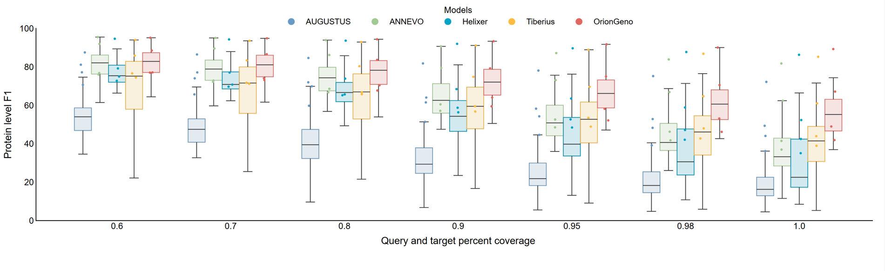

[](https://www.python.org/)
[](https://pepy.tech/project/oriongeno)
# Advancing ab initio gene annotation with OrionGeno

<p align="center">
  <strong>OrionGeno takes a genome FASTA and produces gene and repeat annotations in GTF format.</strong>
</p>

<p align="center">
  
</p>

<p align="center">
  <sub>Figure 2. Mean protein-level F1 across the tested models at coverage thresholds from 0.6 to 1.0. <a href="docs/img/Fig2.png">HD</a></sub>
</p>

## What OrionGeno Does

OrionGeno is an end-to-end model for annotating eukaryotic genomes. You give it a genome FASTA and a species name, and it writes gene annotations, repeat annotations, or both in GTF format.

Given a genome FASTA and a species name, it can:

- predict gene structures
- predict repeat regions
- run both in one pass and write separate GTF files

In most cases, that is all you need: one genome file, one species name, and one output path.

The public interface treats OrionGeno as one unified species-conditioned model. Internal checkpoint routing is handled automatically from the species metadata and is not part of the user workflow.

## Benchmark

- [Gene benchmark](docs/benchmark/gene_benchmark.md)
- [Protein benchmark](docs/benchmark/protein_benchmark.md)

## Installation

#### Env Prepare
- Linux
- Python `>=3.10`
- NVIDIA GPU
- NVIDIA driver with working CUDA runtime

#### Create and Install 
```bash
conda env create -f environment.min.yml
conda activate oriongeno
pip install oriongeno
```

## Download
The model can be downloaded via the following link.              

|      model name      |                                                                            genome                                                                            |                                                                           repeats                                                                            |
|:--------------------:|:------------------------------------------------------------------------------------------------------------------------------------------------------------:|:------------------------------------------------------------------------------------------------------------------------------------------------------------:|
|   `Actinopterygii`   |     🤖[modelscope](https://modelscope.cn/models/zhangchao162/oriongeno-actinopterygii) \| 🤗[HuggingFace](https://huggingface.co/BGI-Research/OrionGeno)     |     🤖[modelscope](https://modelscope.cn/models/zhangchao162/oriongeno-actinopterygii) \| 🤗[HuggingFace](https://huggingface.co/BGI-Research/OrionGeno)     |
|     `Arthropoda`     |       🤖[modelscope](https://modelscope.cn/models/zhangchao162/oriongeno-arthropoda) \| 🤗[HuggingFace](https://huggingface.co/BGI-Research/OrionGeno)       |       🤖[modelscope](https://modelscope.cn/models/zhangchao162/oriongeno-arthropoda) \| 🤗[HuggingFace](https://huggingface.co/BGI-Research/OrionGeno)       |
|        `Aves`        |          🤖[modelscope](https://modelscope.cn/models/zhangchao162/oriongeno-aves) \| 🤗[HuggingFace](https://huggingface.co/BGI-Research/OrionGeno)          |          🤖[modelscope](https://modelscope.cn/models/zhangchao162/oriongeno-aves) \| 🤗[HuggingFace](https://huggingface.co/BGI-Research/OrionGeno)          |
|       `Fungi`        |         🤖[modelscope](https://modelscope.cn/models/zhangchao162/oriongeno-fungi) \| 🤗[HuggingFace](https://huggingface.co/BGI-Research/OrionGeno)          |         🤖[modelscope](https://modelscope.cn/models/zhangchao162/oriongeno-fungi) \| 🤗[HuggingFace](https://huggingface.co/BGI-Research/OrionGeno)          |
| `Invertebrate_other` | 🤖[modelscope](https://www.modelscope.cn/models/zhangchao162/oriongeno-invertebrate_other) \| 🤗[HuggingFace](https://huggingface.co/BGI-Research/OrionGeno) | 🤖[modelscope](https://www.modelscope.cn/models/zhangchao162/oriongeno-invertebrate_other) \| 🤗[HuggingFace](https://huggingface.co/BGI-Research/OrionGeno) |
|      `Mammalia`      |        🤖[modelscope](https://modelscope.cn/models/zhangchao162/oriongeno-mammalia) \| 🤗[HuggingFace](https://huggingface.co/BGI-Research/OrionGeno)        |        🤖[modelscope](https://modelscope.cn/models/zhangchao162/oriongeno-mammalia) \| 🤗[HuggingFace](https://huggingface.co/BGI-Research/OrionGeno)        |
|       `Plant`        |         🤖[modelscope](https://modelscope.cn/models/zhangchao162/oriongeno-plant) \| 🤗[HuggingFace](https://huggingface.co/BGI-Research/OrionGeno)          |         🤖[modelscope](https://modelscope.cn/models/zhangchao162/oriongeno-plant) \| 🤗[HuggingFace](https://huggingface.co/BGI-Research/OrionGeno)          |
|  `Vertebrate_other`  |    🤖[modelscope](https://modelscope.cn/models/zhangchao162/oriongeno-vertebrate_other) \| 🤗[HuggingFace](https://huggingface.co/BGI-Research/OrionGeno)    |    🤖[modelscope](https://modelscope.cn/models/zhangchao162/oriongeno-vertebrate_other) \| 🤗[HuggingFace](https://huggingface.co/BGI-Research/OrionGeno)    |


## Quick Start

```cli
oriongeno pipeline \
    --genome /data/home/GCF.xxx._genomic.fna.gz \
    --species_name Homo_sapiens \
    --out /output/home/example.gtf \
    --batch_size 4 \
    --model /checkpoints/Mammalia
```

The default CLI behavior is:
- `use_gene_annotation=True`
- `use_repeat_annotation=False`
- `include_utr=False`
- `seq_len=512000`
- `flank_bp=128000`

### Gene annotation only

This is the default.

### Repeat annotation only

```cli
oriongeno pipeline \
    --genome /data/home/GCF.xxx._genomic.fna.gz \
    --species_name Homo_sapiens \
    --out /output/home/example.gtf \
    --batch_size 4 \
    --model /checkpoints/Mammalia \
    --use_gene_annotation False \
    --use_repeat_annotation True
```

### Run gene and repeat annotation together

```cli
oriongeno pipeline \
    --genome /data/home/GCF.xxx._genomic.fna.gz \
    --species_name Homo_sapiens \
    --out /output/home/example.gtf \
    --batch_size 4 \
    --model /checkpoints/Mammalia \
    --use_gene_annotation True \
    --use_repeat_annotation True
```

**Note:** At least one of `--use_gene_annotation` and `--use_repeat_annotation` must be `True`.

## Input and Output

### Accepted genome input formats

- `.fa`
- `.fasta`
- `.fa.gz`
- `.fasta.gz`
- `.bz2`

### Output files

If you run:

```bash
--out outputs/sample.gtf
```

you will get:

- `outputs/sample.gene.gtf` when gene annotation is enabled
- `outputs/sample.repeat.gtf` when repeat annotation is enabled

The gene GTF may include:

- `gene`
- `transcript`
- `exon`
- `intron`
- `CDS`
- `start_codon`
- `stop_codon`
- `five_prime_utr`
- `three_prime_utr`

The repeat GTF uses `repeat_region` records and may include attributes such as:

- `repeat_id`
- `repeat_name`
- `repeat_class`
- `repeat_family`
- `repeat_label`

## Arguments

These are the user-facing command-line options exposed by `main.py`.

|         Argument          |                                      Meaning                                       |
|:-------------------------:|:----------------------------------------------------------------------------------:|
|        `--genome`         |                                Genome FASTA input.                                 |
|     `--species_name`      | Required species name for the unified OrionGeno model, for example `Homo_sapiens`. |
|          `--out`          |                          Base path for the output files.                           |
|  `--use_gene_annotation`  |                          Turn gene annotation on or off.                           |
| `--use_repeat_annotation` |                         Turn repeat annotation on or off.                          |
|      `--include_utr`      |               Write UTR features to the gene GTF. Default: `False`.                |
|        `--seq_len`        |                        Sequence length used for inference.                         |
|       `--flank_bp`        |                    Extra context added to each side of a tile.                     |
|      `--batch_size`       |                       Number of sequences processed at once.                       |

## Recommended GPU Settings

|       GPU       | VRAM  | `batch_size`  | `seq_len`  | `flank_bp`  |
|:---------------:|:-----:|:-------------:|:----------:|:-----------:|
|   NVIDIA A100   | `80G` |      `8`      |  `512000`  |  `128000`   |
| NVIDIA RTX 4090 | `24G` |      `2`      |  `512000`  |  `128000`   |

If you run out of memory on another GPU, reduce `batch_size` first.


## Troubleshooting
Having trouble installing `mamba` or `causal-conv1d`? Check out the [official documentation](https://github.com/state-spaces/mamba.git) for full installation guidance and troubleshooting help.

## Citation       
If you use this codebase, or otherwise find our work valuable, please cite OrionGeno:

```
@article{OrionGeno,
  title={OrionGeno xxxxx},
  author={xxx1, xxx2, xxx3, et al},
  journal={xxxx},
  year={2026}
}
```
Please [Contact Us](mailto:yinpeng@genomics.cn?subject=Regarding%20OrionGeno%20Feedback) if you have any questions.